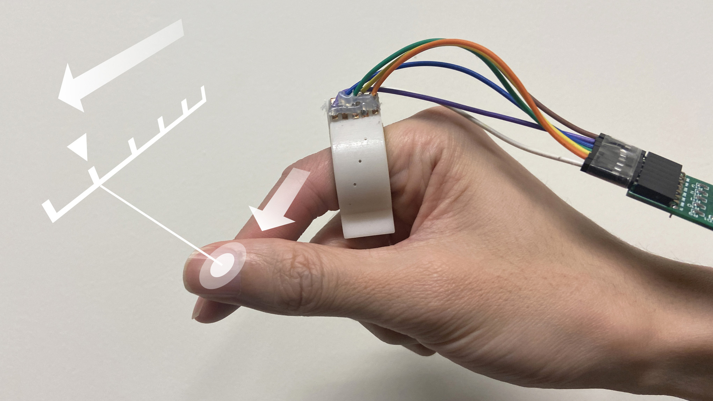

# EFRing
Source code for project: ***EFRing: Enabling Thumb-to-Index-Finger Microgesture Interaction through Electric Field Sensing using Single Smart Ring***

📦Root 
 ┣ 📂GUI 
 ┃ ┣ 📂Continuous_Model     ---- the demo continuous models are detector models for the real-time continuous gesture tracking demo 
 ┃ ┣ 📂EFRing_Qt_4_0_2      ---- the data collection GUI and real-time continuous gesture tracking demo 
 ┣ 📂dataset                ---- the discrete gesture dataset 
 ┣ 📂discrete_gestures      ---- the training code for discrete gesture recognition 
 ┣ 📂hardware               ---- our hardware, including the ring body for 3D printing, an antenna laser cut file, and the PCB. For the details fabrication process, please refer to our paper 